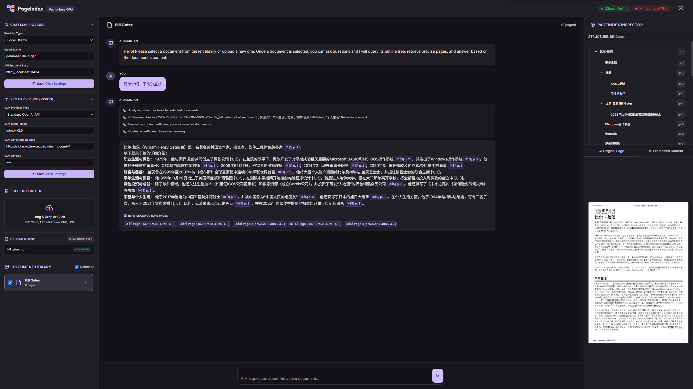

# Local Multimodal RAG

An agentic, vectorless, local multimodal RAG application designed to index, explore, and chat with local documents (PDF, DOCX, TXT, MD, Images) using outline structure trees and visual VLM layout extraction.

---

## 🌟 Key Features

1. **Interactive Notebook Dashboard**: A centralized management interface to create, duplicate, rename, and delete multiple workspaces (notebooks), displaying document summaries, counts, and indexes at a glance.
2. **Multi-Document Chat Selection**: Pick one or more documents from your library using checkboxes to serve as the context for your chat queries.
3. **Agentic Section/Node-Level Routing**: The RAG pipeline queries the document's outline tree first, routing queries to specific section nodes instead of flat pages. It retrieves the precise text chunk of the matched section, minimizing context window clutter.
4. **Hybrid PDF Parsing & Bookmarks Extraction**: PyMuPDF extracts digital text layers and native table-of-contents bookmarks. If bookmarks are missing, it heals the outline by scanning page content for missing references or header structures. VLM is used optionally to transcribe scanned images/charts.
5. **Interactive Node Inspector**: The right inspector panel features a dual-view (Original Page Image / Structured Markdown Text of the active section). Clickable citation pills in the chat automatically switch the inspected document and focus on the cited page.
6. **Robust Document Actions**: Rename, delete, and download original files directly from the Library actions menu. Renaming syncs disk image directories and upload paths, and deleting cleans up all cached files cleanly.
7. **Adjustable Split Layout**: Clean Material 3 style layout with drag-resizable split panes (Left Settings, Center Chat, Right Inspector) that persist pane widths in `localStorage`.



---

## 🔄 Recent Enhancements

We recently added major enhancements to the local chat experience, state persistence, and layout navigation:

1. **Interactive Notebook Dashboard**:
   * Introduced a modern dashboard home page (`/`) that manages all workspaces and notebooks dynamically.
   * Users can create new notebooks, duplicate existing ones (automatically cloning active conversation history and documents), rename workspaces, and delete them with full backend cleanup.
2. **Persistent Notebook Conversation History**: 
   * Chat logs are permanently stored on the backend as presentation-independent structured JSON data (containing raw content, reasoning logs, citations, and timestamps).
   * Conversations are notebook-scoped, auto-restoring historical messages upon reloading or reopening workspaces.
   * User inputs are auto-saved instantly to prevent data loss.
3. **Chat Generation Controls & Graceful Cancellation**:
   * A **Stop** button replaces the send icon while generating (retaining primary visual consistency).
   * Supports **graceful stop signals** via `/api/chat/stop?session_id={session_id}`. This instructs the backend to break the generation loop, wrap up the current partial response, write statistics, and exit the connection cleanly.
   * Session-isolated architecture prevents concurrent multi-tab requests from interfering with each other's stream controls.
   * Text inputs remain **fully editable** during active generation so users can draft their next query, preserving drafts intact when completing or stopping.
4. **High-Fidelity Generation Statistics**:
   * Assistant messages feature a lightweight monospace performance footer (e.g., `8.4s • 31.6 tok/s • 264 tokens (prompt: 120, total: 384) • ttft: 0.12s`).
   * Parses native Ollama API statistics (`prompt_eval_count`, `eval_count`, `eval_duration`, `total_duration`) for exact metrics, falling back to manual token counts and character evaluations for other LLM backends.
   * Measures Time To First Token (TTFT) dynamically inside stream wrappers.
5. **Clear Chat History Button**: Added a "Clear Chat" broom-outline button to the chat header next to the page counts. It prompts for confirmation, deletes stored history via `/api/conversations/active/clear`, resets the view to default greetings, and hides itself when no document context is active.
6. **Pure Runtime Storage**: Refactored the entire `backend/storage/` directory to be a pure runtime folder (completely ignored in `.gitignore`). All sub-directories (`uploads/`, `images/`, `notebooks/`, `cache/`, `conversations/`) are auto-created at boot.
7. **Redirection & Cleanups**: Wired the workspace header logo relatively to `/` for smooth home navigation and removed the duplicate header button from the dashboard.


---

## 🛠️ Tech Stack & Architecture

* **Backend**: Python (FastAPI, Uvicorn, LiteLLM wrapper, PyMuPDF, python-docx, requests)
* **Frontend**: Vanilla HTML5, CSS3 (Material 3 variables, custom themes), Tailwind CSS CDN, Vanilla JS DOM API (pure browser events, `requestAnimationFrame`, `localStorage`)
* **Local Models**: Ollama or Xinference running LLM and VLM

---

## 🚀 Getting Started

### 1. Installation
Clone the repository and install the required Python packages:
```bash
pip install -r requirements.txt
```

### 2. Configure Local Services
Start your local Ollama or Xinference instances:
* **Ollama Default**: `http://localhost:11434`
* **Xinference Default**: `http://localhost:9997`

*(Ensure you have downloaded models with visual capability if using the VLM parser).*

### 3. Run the Application
Launch the FastAPI backend server:
```bash
python backend/app.py
```
By default, the server runs on `http://127.0.0.1:8088`. Open this address in your browser to start uploading files and chatting!

---

## 📚 Acknowledgments & References

This project utilizes and builds upon the following open-source tool:
* **[PageIndex](https://github.com/vectifyai/pageindex)**: A local document indexing utility used to construct outline hierarchical trees, generate node summaries, and segment page texts. Many thanks to the authors for this foundation.

---

## 📄 License

This project is licensed under the **MIT License**. Feel free to use, modify, and distribute it.
